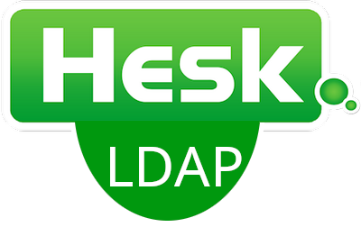

<a name="readme-top"></a>

<div align="center">
  <a href="https://github.com/Kinderschutzbund-Karlsruhe/HeskPlugin_LDAP/graphs/contributors">
    
  </a>
  <a href="https://github.com/Kinderschutzbund-Karlsruhe/HeskPlugin_LDAP/network/members">
    
  </a>
  <a href="https://github.com/Kinderschutzbund-Karlsruhe/HeskPlugin_LDAP/stargazers">
    
  </a>
  <a href="https://github.com/Kinderschutzbund-Karlsruhe/HeskPlugin_LDAP/issues">
    
  </a>
  <a href="https://github.com/Kinderschutzbund-Karlsruhe/HeskPlugin_LDAP/blob/main/LICENSE">
    
  </a>
  
  <!-- PROJECT LOGO -->
  <br />
  <br />
  <a href="https://github.com/Kinderschutzbund-Karlsruhe/HeskPlugin_LDAP">
    
  </a>

  <h3 align="center">Hesk-Plugin: LDAP</h3>

  <p align="center">
    An unofficial plugin for the Hesk.com Help Desk 
    <br />
    <a href="https://www.hesk.com/"><strong>Go to hesk.com »</strong></a>
    <br />
    <br />
    <a href="https://github.com/Kinderschutzbund-Karlsruhe/HeskPlugin_LDAP/issues">Report Bug</a>
    ·
    <a href="https://github.com/Kinderschutzbund-Karlsruhe/HeskPlugin_LDAP/issues">Request Feature</a>
  </p>
</div>


## Table of Contents
<!-- TABLE OF CONTENTS -->
<ol>
  <li><a href="#table-of-contents">Table of Contents</a></li>
  <li>
    <a href="#about-the-project">About The Project</a>
    <ul>
      <li><a href="#built-with">Built With</a></li>
    </ul>
  </li>
  <li>
    <a href="#getting-started">Getting Started</a>
    <ul>
      <li><a href="#prerequisites">Prerequisites</a></li>
      <li><a href="#installation">Installation</a></li>
    </ul>
  </li>
  <li><a href="#usage">Usage</a></li>
  <li><a href="#contributing">Contributing</a></li>
  <li><a href="#license">License</a></li>
</ol>


<!-- ABOUT THE PROJECT -->
## About The Project

This is a unofficial plugin for the Hesk.com Help Desk.

You can use it to connect the Help Desk with your LDAP-Server to synchronize your agents.
All the synchronized agents get the admin-role by default.

Here's why:
* An LDAP-Connection is a requested functionality in the community
* It's always a good idea to use LDAP :smile:

<p align="right">(<a href="#readme-top">back to top</a>)</p>


### Built With

* [![PHP][Php]][Php-url]


<p align="right">(<a href="#readme-top">back to top</a>)</p>


<!-- GETTING STARTED -->
## Getting Started

Just a few steps and you can use LDAP on Hesk.


### Prerequisites

You need to enable the LDAP-extension in the php.ini
* Windows (XAMPP)
  ```ini
  extension=ldap
  ```


* Linux
  For Debian, the installation command would be apt-get install php-ldap
  For RHEL based systems, the command would be yum install php-ldap

  ```ini
  extension=php_ldap.so
  ```
  `/etc/php/[verion]/apache2/php.ini`

<a href="https://www.php.net/manual/de/book.ldap.php">php.net »</a>


### Installation

1. Download and install hesk (<a href="https://www.hesk.com/download.php">Download</a> · <a href="https://www.hesk.com/demo/docs/step-by-step-guide.html">Step by step install guide</a>)
2. Navigate into your hest-root-directory
   ```sh
   cd /var/www/html/hesk/
   ```
3. Clone the repo
   ```sh
   git clone https://github.com/Kinderschutzbund-Karlsruhe/HeskPlugin_LDAP.git
   ```
4. Open `ldap_settings.inc.php` and setup your LDAP-connection
   ```sh
   nano plugin/ldap_settings.inc.php
   ```
5. Setup the Cronjob by crontab
   ```sh
   crontab -e
   ```
   and add this line to setup a cron job 
   ```sh
   */5 * * * * curl -s http://127.0.0.1/hesk/plugin/ldap.php?key=[##URL Access Key##] > /dev/null # Every 5 minutes
   ```
   If you have `URL Access Key` set in `Admin panel > Settings > Help desk > Security > URL Access Key` (which you should), you will need to replace `[##URL Access Key##]` with it to access it via an URL addres.

<p align="right">(<a href="#readme-top">back to top</a>)</p>


<!-- USAGE EXAMPLES -->
## Usage

Your agents will by synchronized in the time interval specified in the cron job.

It is not posible to edit the LDAP-User-Password over the Hesk-UI.
If yout try it, it will have no effect. 

It is posible to add local Hesk-User. They can edit the password over the Hesk-UI.

If there is a LDAP-User with the same mail-address like a local Hesk-User, both accounts will be linked and the LDAP-user-password will be the valid one.

<p align="right">(<a href="#readme-top">back to top</a>)</p>


<!-- CONTRIBUTING -->
## Contributing

If you have a suggestion that would make this better, please fork the repo and create a pull request. You can also simply open an issue with the tag "enhancement".
Don't forget to give the project a star! Thanks again!

1. Fork the Project
2. Create your Feature Branch (`git checkout -b feature/AmazingFeature`)
3. Commit your Changes (`git commit -m 'Add some AmazingFeature'`)
4. Push to the Branch (`git push origin feature/AmazingFeature`)
5. Open a Pull Request

<p align="right">(<a href="#readme-top">back to top</a>)</p>


<!-- LICENSE -->
## License

Distributed under the Apache License 2.0 License. See `LICENSE` for more information.

<p align="right">(<a href="#readme-top">back to top</a>)</p>


<!-- MARKDOWN LINKS & IMAGES -->
<!-- https://www.markdownguide.org/basic-syntax/#reference-style-links -->
[Php]: https://img.shields.io/badge/php-35495E?style=for-the-badge&logo=php&logoColor=7a86b8
[Php-url]: https://www.php.net/
